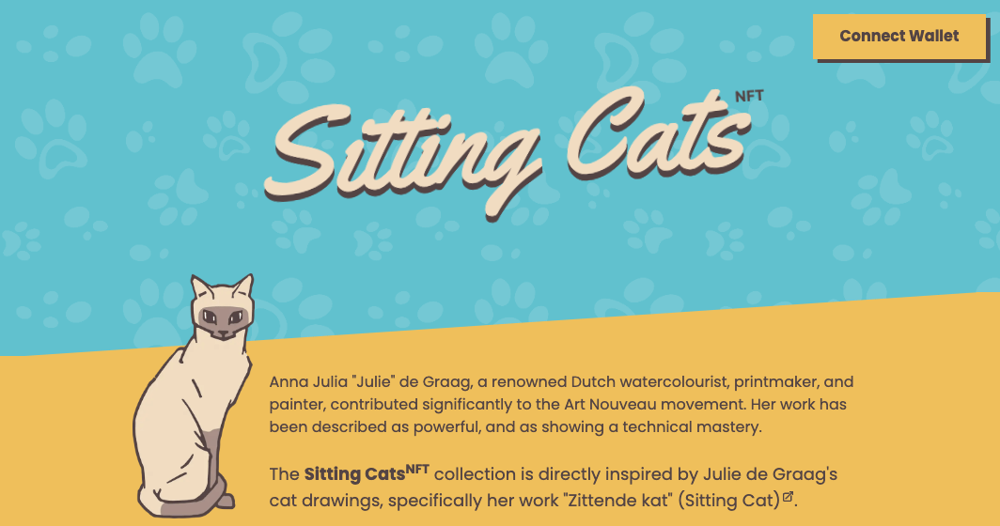
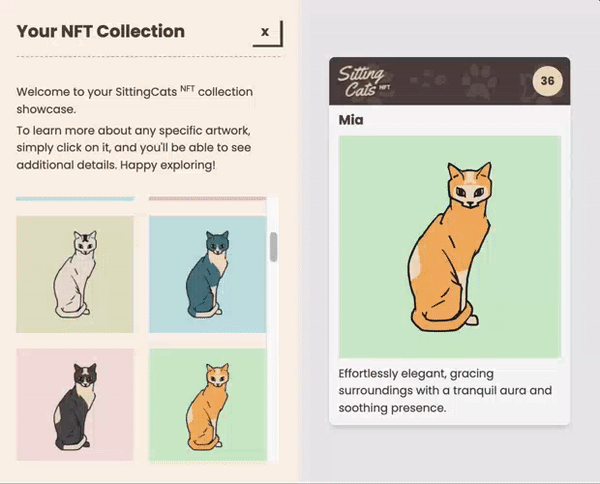

## Introduction

The **Sitting Cats<sup>NFT</sup>** represents a small personal project aimed at showcasing the process of NFT minting on the Polygon Mumbai test network.



The Sitting Cats<sup>NFT</sup> collection is directly inspired by Julie de Graag's cat drawings, specifically her work ["Zittende kat" (Sitting Cat)](https://commons.wikimedia.org/wiki/File:Zittende_kat,_RP-P-1935-892.jpg).



## Running Locally

Clone project locally

Create **.env.local** file in the root directory (check .env.example to see what needs to be included)

Install dependencies:

```bash
npm install
# or
yarn install
# or
pnpm install
```

Run the development server:

```bash
npm run dev
# or
yarn dev
# or
pnpm dev
```

Open [http://localhost:3000](http://localhost:3000) with your browser to see the result.

## Scripts

-   `npm run lint` | `yarn lint` | `pnpm lint` - run the linter to catch code style issues.

-   `npm run tsc` | `yarn tsc` | `pnpm tsc` - checks TypeScript files for type errors without producing output files.

-   `npm run vitest` | `yarn vitest` | `pnpm vitest` - run tests.

## Smart Contract

[thirdweb's NFT Drop contract](https://thirdweb.com/thirdweb.eth/DropERC721)

## Contact

Whether you have inquiries or employment opportunities to discuss, feel free to get in touch.
